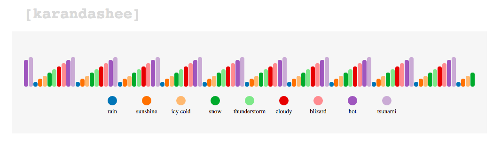

# karanda-shee
[](https://www.npmjs.com/package/@maslick/karandashee)
[](https://npmcharts.com/compare/@maslick/karandashee?minimal=true)
[](https://opensource.org/licenses/MIT)

time series plot for categorical data



## Demo
See [here](https://maslick.github.io/karandashee/demo/).

## Features
* a running plot with bars representing categorical events
* input: Rx streams (e.g. live websocket or MQTT data)
* multiple plots on one page
* leverages ``d3`` and ``rx-lite``
* browser and node.js friendly

## Usage
Include this into your html:

```html
<div id="karandasheeGraph"></div>
```

```html
<script src="vendor/d3.min.js"></script>
<script src="vendor/rx.lite.min.js"></script>
<script src="dist/karandashee.min.js"></script>
```

Define your data stream (rx-lite):
```js
const items = ["rain", "sunshine", "icy cold", "snow", "thunderstorm", "cloudy", "blizard", "hot", "tsunami"];

const dataObservable = Rx.Observable
    .interval(500)
    .map(x => {
        return {
            item: items[x % items.length],
            timestamp: new Date().getTime(),
        };
    }).share();
```

Instantiate a Karandashee object:
```js
let karandasheeOptions = {
    graphdiv: "#karandasheeGraph",
    observable: dataObservable,
    key: "item",
    values: items
};

let karandashee = new Karandashee(karandasheeOptions);
```

## Node.js
*Karandashee* can be used either in the [Browser](https://github.com/maslick/karandashee/tree/master/demo) or in the [Node.js](https://github.com/maslick/karandashee/tree/master/node) environment.


## License

This project is licenced under the [MIT License](http://opensource.org/licenses/mit-license.html).
